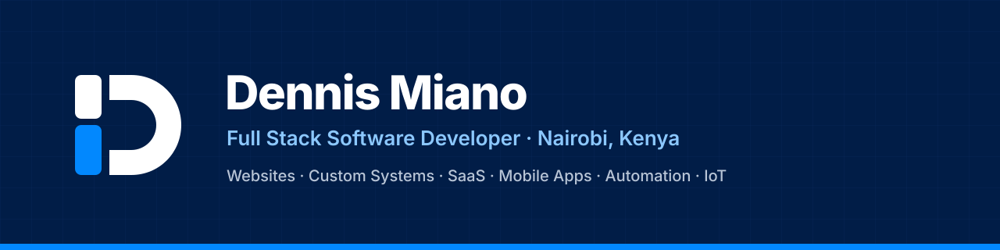

  

  
  
  
  
  

## Hi, I'm Dennis.

I design and build websites, systems and mobile apps that businesses actually run on — built around how you work.

I've spent **6+ years** shipping software for clients in Kenya and abroad, with **10+ projects delivered** across web, mobile, systems and IoT. I care about software that keeps working when the internet doesn't, and support you can actually reach.

## What I do

| | |
|---|---|
| **Websites & Web Design** | Business websites, landing pages, UI/UX |
| **Custom Software & Systems** | POS, inventory, booking — offline-first |
| **SaaS & Internal Platforms** | Cloud platforms, dashboards, back-office tools |
| **Mobile Apps** | Cross-platform Flutter apps for Android & iOS |
| **AI Automation, Data & Chatbots** | WhatsApp/website chatbots, workflow automation, dashboards |
| **Technical Consulting & IoT** | Architecture advice, platform support, Arduino prototypes |

## Selected work

- **Kisasa POS** — point-of-sale for retail that works fully offline, tracks sales and inventory, and syncs when reconnected. Windows & Android.
- **[Rentisha](https://rentisha.co.ke)** — rental management platform for landlords and agencies.
- Worked with **[GraceWorks](https://graceworks.co.ke)**, **[Esque Kenya](https://esquekenya.com)**, **[RAJI Global](https://rajiglobal.co.ke)** and more.

## Tech I work with

**Frontend** · React · JavaScript · HTML · CSS · Tailwind · Bootstrap · Leaflet · Mapbox 
**Mobile** · Flutter · Dart 
**Backend** · PostgreSQL · MySQL · Django · Ruby on Rails · Supabase · Firebase · GeoServer · MinIO 
**Data & ML** · Python · R · TensorFlow · PyTorch · scikit-learn · NumPy · Grafana · Excel 
**IoT** · Arduino · C/C++ 
**DevOps** · Git · GitHub · GitLab · Docker · Linux · Cloudflare · AWS · Vultr 
**Design** · Figma · Adobe Illustrator

## Background

- BSc Computer Science — Egerton University
- Full Stack Software Engineering — Moringa School
- Cybersecurity — Moringa School
- Flutter Mobile App Development — Udemy

## How I work

1. **Discover** — a free call to understand your business, then a clear scope, SRS and quotation.
2. **Build** — iterative delivery with regular demos, so there are no surprises.
3. **Launch & support** — testing, deployment, training and ongoing support.

---

  <b>Have a project in mind? Let's talk.</b> 
  <a href="mailto:hello@deemiano.com">hello@deemiano.com</a> · <a href="tel:+254722525547">+254 722 525 547</a> · <a href="https://calendly.com/dennismiano/discoverycall">Book a call</a>

